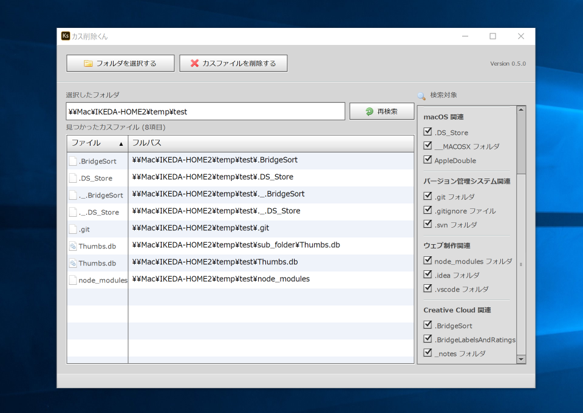
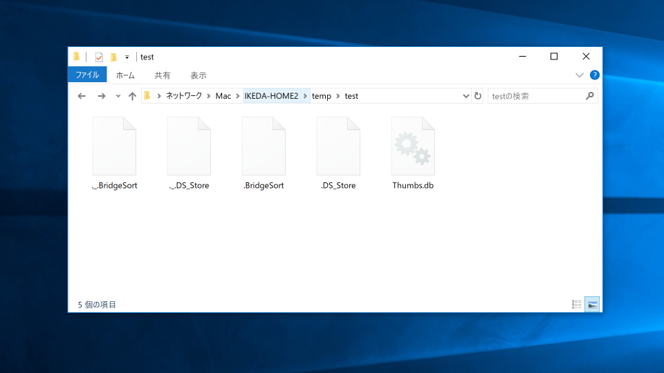

OS やファイル管理システムが作成する不可視ファイル（通称：カスファイル）を一括で削除するアプリです。主にWeb/RIA開発などでファイルを公開・納品するときなどに役立ちます。

- [ダウンロードはこちら](https://github.com/ics-creative/project-refuse-deleter-air/blob/master/RefuseDeleter/air/RefuseDeleter_0.5.0.air?raw=true)

次のリンクから「カス削除くん」の最新版の AIR アプリのファイルをダウンロードできます。AIR アプリなので、Windows/macOS/Linux のいずれの OS でも利用可能です。

※最新版の [Adobe AIR ランタイム](http://www.adobe.com/go/getair/)が必要です。

※従来の「カス削除くん」をお使いの場合、
あらかじめアンインストールください。インストールに失敗するためです。

- macOSの場合はアプリケーションをゴミ箱へ（そしてゴミ箱を空に）。
- Windowsの場合は「設定」内の「アプリと機能」の一覧からアンインストールください。

## 目的

Mac や Windows で作られる不可視ファイルは、OS をまたいでファイル交換をする場合にあって困るものではありませんが、別の OS の利用者から見たら気持ちのよいものでない場合もあります。「カス削除くん」はそういったカスファイルを一括で削除する便利アプリケーションです。

## 機能紹介

不要ファイルの削除は、次の形式に対応しています。

- 「Thumbs.db」 (Windows のカスファイル)
- 「Desktop.ini」 (Windows のカスファイル)
- 「.DS_Strore」 (macOS のカスファイル)
- 「._」から始まるアップルダブルファイル (macOS のカスファイル ※Windowsのみで削除可能)
- 「.git」 (Gitのカスフォルダー)
- 「.gitignore」 (Gitのカスファイル)
- 「.svn」 (サブバージョンのカスフォルダー)
- 「.vscode」 (Visual Studio Code のカスフォルダー)
- 「.idea」 (IntelliJ IDEA のカスフォルダー)
- 「_notes」 (Adobe Dreamweaver のカスフォルダー)
- 「.BridgeSort」 (Adobe Bridge のカスファイル)
- 「.BridgeLabelsAndRatings」 (Adobe Bridge のカスファイル)

サブフォルダの検索にも対応しているので、深い階層まで一括で検索することができます。

## 注意点

- カスファイルの削除は一括削除で、ゴミ箱にも残りませんのでご注意ください。
- ［サブフォルダも含める］をチェックした状態で、巨大なフォルダを検索すると時間がかかります。
- カスファイルは不要なものとして紹介していますが、人によっては必要なファイルである場合があります。ファイル形式のことをよくわからない場合は、検索対象から外して利用されることをお勧めします。
- MIT ライセンスとして公開していますが、ライセンスの通り、当アプリを利用して起きたトラブルは責任を負いかねますのでご了承ください。
- アンインストールの方法は、インストーラー(.air)をもう一度起動し［アンインストール］ボタンをクリックします。Windowsの場合は「アプリケーションの追加と削除」からもアンインストールできます。

## メディア掲載

- [WindowsやMac OSが残す“カスファイル”を一掃する（第142回） \| 日経 xTECH（クロステック）](https://tech.nikkeibp.co.jp/it/pc/article/special/20101108/1028379/)
- [不要になる不可視ファイルを一括削除「カス削除くん」 \- 今日のお気に入り \- 窓の杜](https://forest.watch.impress.co.jp/docs/serial/okiniiri/398205.html)
- [リリース時の記事](http://clockmaker.jp/blog/2010/08/refusedeleter/)
